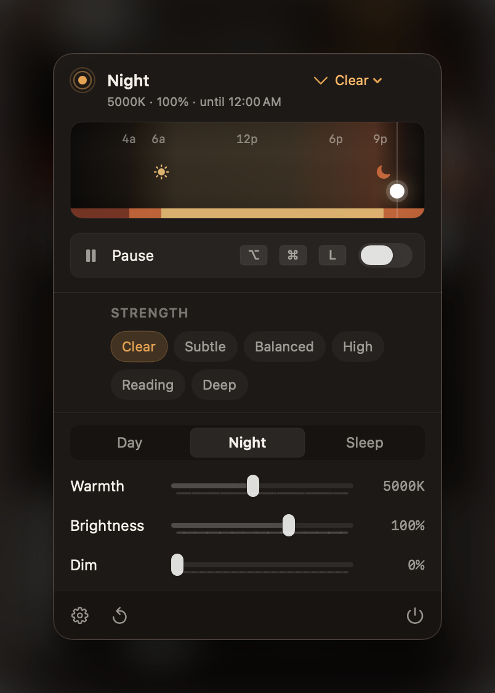

# Luma

Luma is a clean-room, native Apple Silicon macOS menu bar utility for screen warmth, dimming, and scheduled day/night display profiles.

<p align="center">
  
</p>

Luma does not reuse Iris source code, assets, license behavior, or private app data. It is not affiliated with Iris, iristech.co, or any Iris product.

Presets let you switch the overall display effect between Clear, Barely, Subtle, Balanced, High, Deep, Reading, Late Night, and Custom. Presets update day, night, and sleep profiles together; manual slider changes switch the app to Custom.

## Features

- Warmth (color temperature) and dimming control from the menu bar
- Day, Night, and Sleep profiles that switch automatically
- Nine built-in presets plus a Custom mode driven by manual sliders
- Sunset/sunrise scheduling from your latitude/longitude, or a manual time window
- Global hotkeys for quick adjustments without opening the app
- Optional one-time importer for existing Iris visual and schedule settings
- CoreGraphics gamma adjustment with a click-through overlay fallback for displays that reject direct gamma changes

## Requirements

- macOS 14.0 or later
- Apple Silicon Mac

## Download And Install

Download the latest `Luma-*-arm64.dmg` from the [Releases](https://github.com/chountalas/Luma/releases) page, open it, and drag Luma into Applications.

Public builds are signed with a Developer ID and notarized by Apple, so they open without a Gatekeeper warning. To build from source instead, see below.

## Privacy

Luma stores its own settings in the local macOS defaults store for the app. The optional Iris importer reads only the current user's local Iris preferences plist and maps visual and schedule values into Luma settings. It does not read Iris source code, license data, account data, or private app data.

## Build And Run

Install Xcode and XcodeGen, then run:

```bash
./script/build_and_run.sh --verify
```

The app uses a CoreGraphics gamma table where macOS allows it and falls back to click-through overlay windows if a display rejects direct gamma changes.

Quit other display-filter apps before using Luma as the daily driver. Running multiple display filters at the same time can make them override each other.

## Package A Downloadable App

```bash
./script/package_release.sh
```

This produces:

- `dist/Luma-0.1.4-arm64.dmg`
- `dist/Luma-0.1.4-arm64.zip`
- `dist/checksums.txt`

The local package is signed ad hoc by default. For a no-warning public download, set `CODE_SIGN_IDENTITY` to a Developer ID Application certificate and notarize the DMG.

## Contributing

Issues and pull requests are welcome for bug fixes, compatibility improvements, and small usability improvements. Please keep changes focused and include a local build or test result when possible.

For security issues, see `SECURITY.md`.

## License

Luma is released under the MIT License. See `LICENSE`.
